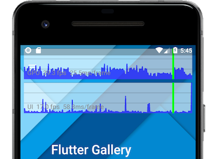

<div class="whats-the-point" markdown="1">

<b> <a id="whats-the-point" class="anchor" href="#whats-the-point" aria-hidden="true"><span class="octicon octicon-link"></span></a>你将学习到:</b>

* Flutter 旨在提供 60 帧/秒的刷新率,对于刷新率 120Hz 以上的设备上能达到 120帧/秒。
* 60fps 意味着大约平均每 16ms 渲染一帧。
* 当 UI 不能平滑的渲染时就会出现掉帧。举个例子，有时一帧花费了 10 倍的时间去渲染，这段期间的就会丢帧，从而就会看到动画就出现了明显的抖动。

</div>

有句话说的好，“一个**快速**的应用 是不错,但一个**流畅**的应用更好。”
如果你的应用程序渲染不流畅，如何解决它？从哪里着手呢？
本指南将向您展示从哪里开始分析，采取的步骤，以及涉及到的相关工具。

<aside class="alert alert-info" markdown="1">
**注意：**应用程序的性能取决于多方面的考量。
狭义的性能有时单指速度，广义的性能涉及到 UI 是否流畅,以及其他方面的指标,比如 I/O 或网速。本页面主要关注第二种的性能指标（ UI 的平滑度），当然您也可以用绝大多数同样的工具来诊断其他性能指标。
</aside>

* TOC Placeholder
{:toc}

## 诊断性能问题

要诊断出现性能问题的 app，请打开性能覆盖图监测 UI 和 GPU 线程。在此之前,首先确保你是在 profile 模式下运行，而且用的不是模拟器。为了达到最好的效果，你可以选择用用户可能使用到性能最慢的设备。


<div class="whats-the-point" markdown="1">

<b> <a id="whats-the-point" class="anchor" href="#whats-the-point" aria-hidden="true"><span class="octicon octicon-link"></span></a>有什么意义呢？</b>

* 在一个物理设备上调试你的应用。
* 在[profile 模式](https://github.com/flutter/flutter/wiki/Flutter%27s-modes)下调试你的 app。
* 在可能使用的性能最低的设备上测试应用的表现。
* 在应用启动时开启性能覆盖图。

</div>


### 连接到物理设备

几乎所有 Flutter 应用程序的性能调试都应该在 android 和 iOS 物理设备上以 profile 模式运行。在 debug 模式下，或模拟器上或仿真器运行的应用程序，都不能作为应用的 release 模式构建的最终的表现。**你应该考虑在用户可能用到的低配设备上进行监测。**

<aside class="alert alert-info" markdown="1">
**为什么应该在真机上运行：**

* 模拟器和仿真器使用的是不相同的硬件，所以他们的性能特征不一样&mdash;在模拟器上有些操作比真机快，有些比真机慢。
* Debug 模式下开启了一些额外的检查（比如断言），这些不会运行在 profile 或 release 的版本中，因为这些检查开销可能会很大。
* Debug 模式和 release 模式执行代码的方式也有所不同。debug 版本随着应用程序的运行而运行,即时的编译 Dart 代码 "just in time" (JIT)，而 profile 和 release 版本会在应用程序的加载到设备上之前,将预编译 Dart 代码成本地指令（也称为 “ahead of time”，或 AOT）。JIT 可能会由于即使的 JIT 编译而导致 app 停滞,可能造成掉帧.
</aside>

### 在profile 模式下运行

profile 模式编译和启动 Flutter 应用程序几乎与 release 模式完全相同，也提供了允许调试性能问题的其他功能。 例如，profile 模式提供了信息跟踪 [Observatory](https://dart-lang.github.io/observatory/) 和其他工具。

在 profile 模式下启动应用程序，如下所示：


尚未在 VS Code 中提供。


<ul markdown="1">
<li markdown="1">在 Android Studio 和 IntelliJ 中，使用 **Run > Flutter Run main.dart in Profile Mode** 菜单项。
</li>
<li markdown="1">在 VS Code 中，打开你的 `launch.json` 文件，并设置 `flutterMode` 属性为 `profile`（在 profile 测试完成后，将其改回到 `release` 或 `debug` 模式）：

```
"configurations": [
	{
		"name": "Flutter",
		"request": "launch",
		"type": "dart",
		"flutterMode": "profile"
	}
]
```
<li markdown="1">从命令行使用,使用 `--profile` 标示:


$ flutter run --profile

</li>
</ul>

更多有关不同模式如何工作的信息，请参见 [Flutter 的模式们](https://github.com/flutter/flutter/wiki/Flutter%27s-modes)。

在下一节中我们将会讨论性能覆盖图。

## 性能覆盖图

性能覆盖图提供了两个曲线图来展示您的应用程序所花时间的统计数据。如果 UI 非常卡顿（跳帧），这些曲线图可以帮助您找出原因。曲线图展示了运行在最上层的 app,但是他们不是像绘制一个普通小控件那样&mdash; Flutter 引擎本身绘制的叠加层只会对性能产生很小的影响。
每条曲线图代表着该个线程的最新的 300 帧。

本节介绍如何启用 [PerformanceOverlay](https://docs.flutter.io/flutter/widgets/PerformanceOverlay-class.html)，利用它来诊断您的应用程序出现异常的原因。
下面的截图展示在 Flutter Gallery 项目里运行时性能覆盖图的例子：

<center></center>
<center>绿色的竖条代表当前帧。</center><br>

Flutter 使用多个线程来工作。您所有的 Dart 代码运行在 UI 线程中。虽然你没有直接访问任何其他线程的权限，但您在 UI 线程上的操作也会对其他线程产生性能影响。

1. 平台线程<br>
   平台的主线程。插件代码在此线程运行。
   更多相关信息，请参阅适用于 iOS 的文档
    [UIKit](https://developer.apple.com/documentation/uikit) ，或者适用于 Android 的文档
   [MainThread](https://developer.android.com/reference/android/support/annotation/MainThread.html) 。

1. UI 线程<br>
   UI 线程在 Dart 虚拟机中执行 Dart 代码。
   该线程包括您编写的代码和 Flutter 框架中支持你 app 所执行的代码。
   当您的应用程序创建并显示一个场景时，UI 线程将创建一个**层次树** 一个包含了绘制指令与设备无关的轻量级对象，然后将生成的层次树发送给渲染设备的 GPU 线程作展示。**不要阻塞此线程！**

1. GPU 线程<br>
   GPU 线程通过和 GUP（图形处理单元）沟通来展示层次树。
  你没有直接访问 GPU 线程或其数据的权限，但是如果此线程变慢，是由于你在 Dart 代码中做了什么导致的。由于 Skia -图形库，在这个线程上运行，所以有时候这个线程也被称为**光栅器线程**。

1. I/O 线程<br>
   平台中开销很大的任务（主要是 I/O）,可能导致 UI 线程或 GPU 线程的阻塞。

更多有关这些线程的信息，请参阅 [架构笔记](https://github.com/flutter/engine/wiki#architecture-notes)。

每一帧应在 1/60 秒（大约 16ms）内创建并显示 。当有一帧（在任一图中）超过这个极限时将导致无法显示，从而导致掉帧，会在下面的两幅曲线图中的一幅出现一条或两幅都出现红色的竖条。
如果在 UI 图中出现红色条块，则表示 Dart 代码开销太大了。
如果在 GPU 图中出现红色竖条，则表示该场景太复杂以致于难以快速渲染。

<center></center>
<center>红色竖条显示当前帧对于渲染和绘制消耗很大。<br>当两个图表都有红色，优先分析 UI 线程（Dart 虚拟机）</center><br>

### 显示性能覆盖图

您可以通过下列方式切换显示性能覆盖图，如下所示：

* 通过 Flutter Inspector 调用
* 通过命令行调用
* 通过编程的方式调用

#### 通过 Flutter Inspector 调用

启动 PerformanceOverlay 控件的最简单方式就是通过 Flutter Inspector（可以通过 IDE 里的 Flutter 插件启动）。当以 Inspector 视图运行一个应用时是默认开启的。如果没有开启，可以根据如下步骤打开。

在 Android Studio 和 IntelliJ IDEA 中：

1. 选择 **View > Tool Windows > Flutter Inspector**。

1. 在工具栏中，选中那个看起来像书架的图标().

<br>

Flutter Inspector 对 Android Studio 和 IntelliJ 都支持。
更多关于 Inspector 的介绍，请看 [Flutter Widget Inspector](/inspector/)，和 2018 年发布在 DartConf 上的 [对话Flutter Inspector ](https://www.youtube.com/watch?v=JIcmJNT9DNI)。

#### 在 VS Code 中

1. 选中 **View > Command Palette…** 以调出命令面板。
1. 在输入框输入 "performance" 在弹出的列表中选择 **Toggle Performance Overlay**。如果无法选中，请确保应用程序正在运行状态。

#### 通过命令行调用

使用命令行中的 **P** 键切换性能覆盖图。

#### 通过编程的方式调用

你可以通过在 MaterialApp 上或 WidgetsApp 的构造函数中将 `showPerformanceOverlay` 属性设为 `true` 方式开启 PerformanceOverlay 控件。

<!-- skip -->

class MyApp extends StatelessWidget {
  @override
  Widget build(BuildContext context) {
    return new MaterialApp(
      [[highlight]]showPerformanceOverlay: true,[[/highlight]]
      title: 'My Awesome App',
      theme: new ThemeData(
        primarySwatch: Colors.blue,
      ),
      home: new MyHomePage(title: 'My Awesome App'),
    );
  }
}


也许你熟悉示例应用 Flutter Gallery。
要调用 Flutter Gallery 的性能覆盖图，只需拷贝已经安装的 Flutter 目录里 [examples](https://github.com/flutter/flutter/tree/master/examples/flutter_gallery) 下的文件夹,以 profile 模式运行执行该程序。由于代码已经写好，所以 app 的菜单允许您开关覆盖层，以及开启对 `saveLayer` 的调用和当前缓存的图像的检查。

<aside class="alert alert-info" markdown="1">
**注意:**你不能在从应用商店下载的 Flutter Gallery 应用中开启性能覆盖图。那个 app 编译的版本是 release 版本（不是 profile 版本），不会提供开关叠加层的菜单选项。
</aside>

### 根据 UI 曲线图定位问题

如果性能覆盖图在 UI 曲线图中显示红色，请从 Dart 虚拟机开始分析（即使 GPU 图也显示为红色）。要做到这一点，请借助 [Observatory](https://dart-lang.github.io/observatory/)，Dart 的分析工具。

#### 显示 Observatory

Observatory 提供的功能像性能分析包括，检查堆，和显示代码覆盖率。 Observatory 的 _timeline_ 视图能够及时捕获堆的快照。 当你从 Flutter Inspector 打开 Observatorty 的 timeline 时，看到的是 Flutter 定制版本。

按照如下步骤在浏览器中打开 Flutter 的时间轴视图：

<ol markdown="1">
<li markdown="1">
您可以点击折线图标)打开时间轴视图。

（相应的，您可以通过秒表图标()打开 Observatory， 
但是 "view <u>inspector</u>" 链接会将您带到 timeline 的标准版本，而不是为 Flutter 定制版本。）


</li>

<li markdown="1">
在 VS Code 中，打开命令面板输入 "observatory"。
在弹出的菜单中选择 **Flutter: Open Observatory Timeline**。
如果该指令无效，请确保 app 正在运行状态。
</li>
</ol>

#### Observatory 的 timeline 的使用

<aside class="alert alert-info" markdown="1">
**注意：** Observatory  UI 和 Flutter 定制的时间轴页面是实时变化的。由于这个原因，我们本次还没有完全记录这个界面。
如果您觉得 Observatory 的体验不错，愿意给予我们的反馈，当有问题时请提交到 [issues or feature
requests](https://github.com/dart-lang/sdk/issues?q=is%3Aopen+is%3Aissue+label%3Aarea-observatory)
。

</aside>

### 定位在 GPU 曲线图中的问题

有时候一个屏幕根据层次树容易构建出来，但对于 GPU 线程来说渲染是很大开销。当这种情况发生时，UI 的曲线图不会显示红色，但是 GPU 的曲线图会出现红色，在这个情况下，你要弄清楚你的代码在做什么使得渲染代码变得很慢。特定类型的工作负载加重 GPU 的工作。他们可能因为到调用了多余的 [`saveLayer`](https://docs.flutter.io/flutter/dart-ui/Canvas/saveLayer.html)，
或在一些特定情景下,比如与其他多个对象发生重叠,裁剪,或遮蔽。

如果您怀疑引起变慢的因素发生在动画期间，请使用 [timeDilation](https://docs.flutter.io/flutter/scheduler/timeDilation.html)
 属性使得动画调得很缓慢。

您也可以用 Flutter Inspector 来减慢动画的速度。
在 inspector 的齿轮菜单中，选择 **Enable Slow Animations**。
如果您想要更多地控制动画速度，请设置 [timeDilation](https://docs.flutter.io/flutter/scheduler/timeDilation.html) 的属性在你的代码中。

是在第一帧加载速度慢还是整个动画？
如果是整个动画，是否由于剪辑导致的速度变慢？
也许绘制场景有替代剪裁的方法。例如，将不透明的角覆盖在正方形上，而不是将对象裁成圆角矩形。
如果这是一个静态场景包含有颜色渐变，旋转或其他操作，也许 [RepaintBoundary](https://docs.flutter.io/flutter/widgets/RepaintBoundary-class.html) 可以帮上忙。

#### 检查画面外的布局

[`saveLayer`](https://docs.flutter.io/flutter/dart-ui/Canvas/saveLayer.html) 方法是 Flutter 框架中开销最大的方法之一。它在对场景进行后期处理时非常有用， 但它会使你的应用程序变慢，在你不需要时应该避免调用它。
即使你没有直接调用 `saveLayer`，它也可能被的隐式调用。你可以通用开关 [PerformanceOverlayLayer.checkerboardOffscreenLayers](https://docs.flutter.io/flutter/rendering/PerformanceOverlayLayer/checkerboardOffscreenLayers.html) 来检查你的场景是否用到了 `saveLayer`。


[TODO：禁用曲线图和 checkerboardRasterCachedImages 的文档。Flutter Inspector 似乎不支持这]


一旦打开开关，运行程序并查找被闪烁的方框勾勒出来的图像,这个框会随着新帧渲染一帧一帧的闪烁。例如,假设你有一组用 `saveLayer` 渲染的带透明度的对象。在这种情景下，在每个独立的控件上应用的透明度可能比在控件树的上父控件更高效。
而其他潜在的大开销的操作，例如剪辑或阴影也是同样的道理。

<aside class="alert alert-info" markdown="1">
**注意：** 透明度、裁剪和阴影本身并不是一个坏主意。但是，如果应用到控件树的顶层可能会造成 `saveLayer` 的额外调用，引发多余的处理。
</aside>

当你遇到需要调用 `saveLayer` 时，问自己这些问题：

* 应用程序是否需要这种效果？
* 是否能够减少某些调用吗？
* 我可以将相同的效果应用于某一个元素而不是一组元素吗？

#### 非缓存图像的检查

用 [RepaintBoundary](https://docs.flutter.io/flutter/widgets/RepaintBoundary-class.html) 缓存图像是个不错的选择。
 
从资源角度来看，通过图片绘制纹理开销最大的操作之一。首先，从持久存储中获取压缩图像。图像解压缩后存入主机内存（GPU 内存），再传入设备内存（RAM）。

换句话说，图像 I/O 流的开销可能很大。
缓存提供了复杂层次结构的快照，使得后续帧渲染实现更容易。
**由于基于存储的光栅入口渲染占用 GPU 内存开销非常大，请仅在十分必要的时候才缓存图像.**

你可以通过开启 [PerformanceOverlayLayer.checkerboardRasterCachedImages](https://docs.flutter.io/flutter/widgets/PerformanceOverlay/checkerboardRasterCacheImages.html) 开关查看缓存的图片。


[TODO：记录如何通过 UI 或编程方式执行此操作。 此时，禁用图形和 checkerboardOffScreenLayers。]


运行应用程序如果看到图像带有随机颜色的棋盘格，这表示图像已缓存。当你做场景交互时，被棋盘格标志了的图片应该保持不变—你不想看的图像上的闪烁，这表明缓存过的图像正在被重新缓存。

大多数情况下，您希望在静态图像上看到棋盘格， 但不是在非静态图像上。如果静态图像没有被缓存， 你可以将它缓存在 [RepaintBoundary](https://docs.flutter.io/flutter/widgets/RepaintBoundary-class.html) 控件中。虽然引擎也许会认为图像复杂度不够可能仍然忽略重绘的边界 。

## 调试标志

Flutter 提供各种调试标记和函数来帮助您在程序开发周期的不同阶段调试您的应用程序。要用到这些特性，您必须在 debug 模式下进行编译。下面列表（不是完整的）来自[渲染库](https://docs.flutter.io/flutter/rendering/rendering-library.html)，突出了对调试性能问题的调试有帮助的一些标记（和一个函数）。

* [`debugDumpRenderTree()`](https://docs.flutter.io/flutter/rendering/debugDumpRenderTree.html)<br>
  当不在布局或重绘阶段调用此函数将会把渲染树打印到到控制台上。（在 `flutter run` 时按 **t** 调用此命令。）搜索 “RepaintBoundary” 以判断在何处添加边界。
* [`debugPaintLayerBordersEnabled`](https://docs.flutter.io/flutter/rendering/debugPaintLayerBordersEnabled.html)
* [`debugRepaintRainbowEnabled`](https://docs.flutter.io/flutter/rendering/debugRepaintRainbowEnabled.html)<br>
  启用该属性并运行您的应用以查看 UI 是否有改变（例如，一个静态头部）当图层重新绘制时，它将让图层显示旋转的色彩。
  这些添加的区域是重绘边界的候选对象。
* [`debugPrintMarkNeedsLayoutStack`](https://docs.flutter.io/flutter/rendering/debugPrintMarkNeedsLayoutStacks.html)<br>
  如果看到比预期更多的布局，请启用此属性（例如，可能用在时间轴上，配置文件中，或者布局方法中的 "print" 语句里）。一旦开启，控制台会打印出堆栈信息来显示为什么布局中每个渲染对象被标为 dirty。
* [`debugPrintMarkNeedsPaintStacks`](https://docs.flutter.io/flutter/rendering/debugPrintMarkNeedsPaintStacks.html)<br>
  类似于 `debugPrintMarkNeedsLayoutStack`,用作调试过度绘制。

你可以在 [Debugging Flutter Apps](https://flutter.io/debugging/) 了解到其他调试 debug 标记。

## 基准测试

您可以通过编写基准测试来度量及追踪您的应用程序的性能。
Flutter Driver 库提供了基准测试的支持，使用该集成测试框架，您可以生成以下度量指标：

* 掉帧
* 下载的大小
* 电池的效率
* 启动时间

分析这些指标可以得出影响性能衰退的不利因素。

有关更多信息，请参阅
[集成测试](https://flutter.io/testing/#integration-testing),
[Testing Flutter Apps](https://flutter.io/testing/)的部分内容。

## 更多信息

下列提供了更多有关于介绍如何调试 Flutter 应用和调试工具的使用资料：

* [调试 Flutter 应用](https://flutter.io/debugging/)
* [Flutter Widget Inspector](https://flutter.io/inspector/)
* [对话 Flutter Inspector](https://www.youtube.com/watch?v=JIcmJNT9DNI)，2018 年发表在 DartConf。
* [Flutter 为什么使用 Dart](https://hackernoon.com/why-flutter-uses-dart-dd635a054ebf)，一篇发表在 Hackernoon 的文章.
* [Observatory:Dart 应用的剖析器](https://dart-lang.github.io/observatory/)
* [Flutter API](https://docs.flutter.io/index.html) 文档, 特别是
  [PerformanceOverlay](https://docs.flutter.io/flutter/widgets/PerformanceOverlay-class.html) 类, 和
  [dart:developer](https://docs.flutter.io/flutter/dart-developer/dart-developer-library.html) 包。